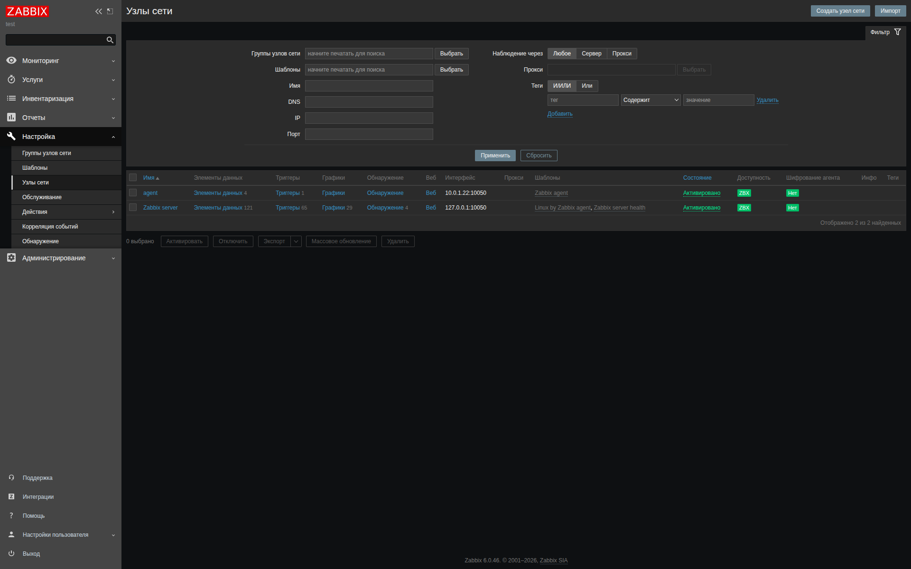
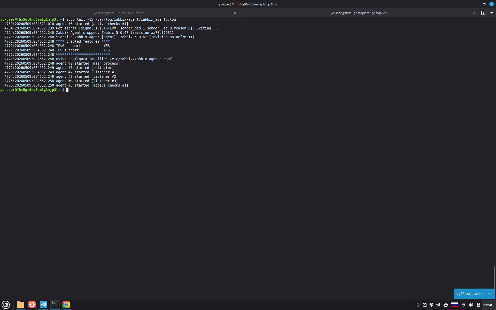
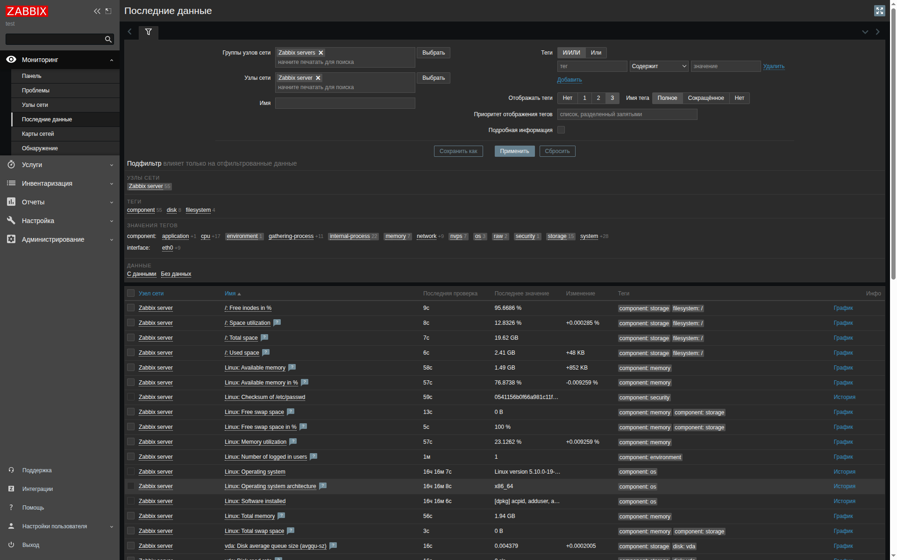
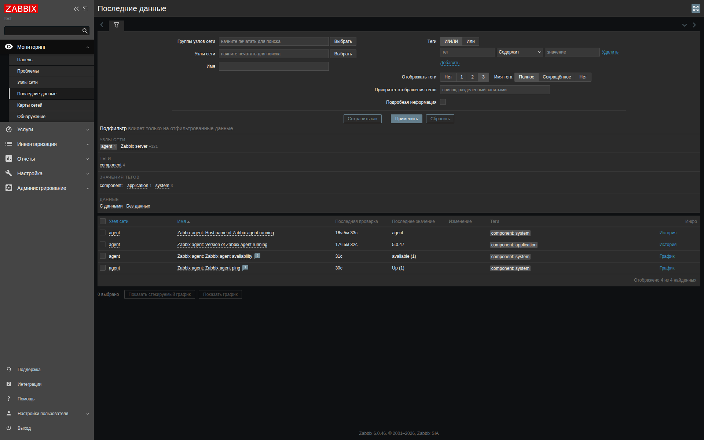

# Домашнее задание к занятию «Система мониторинга Zabbix» Кукушкина Марина


# Задание 1
В рамках домашнего задания был установлен Zabbix Server 6.0 с поддержкой PostgreSQL и веб-интерфейсом на базе Apache. Установка производилась на виртуальную машину Debian 11 в Yandex Cloud

# Все использованные команды для установки
```bash
sudo apt update && sudo apt upgrade -y
sudo apt install -y postgresql postgresql-contrib

wget https://repo.zabbix.com/zabbix/6.0/debian/pool/main/z/zabbix-release/zabbix-release_latest_6.0+debian11_all.deb
dpkg -i zabbix-release_latest_6.0+debian11_all.deb
sudo apt update

sudo apt install -y zabbix-server-pgsql zabbix-frontend-php php7.4-pgsql zabbix-apache-conf zabbix-sql-scripts 

sudo -u postgres createuser --pwprompt zabbix
sudo -u postgres createdb -O zabbix zabbix
zcat /usr/share/zabbix-sql-scripts/postgresql/server.sql.gz | sudo -u zabbix psql zabbix

sudo nano /etc/zabbix/zabbix_server.conf  # Установка DBPassword

sudo systemctl restart zabbix-server apache2
sudo systemctl enable zabbix-server  apache2
```
## Результат установки

### Скриншот авторизации в веб-интерфейсе Zabbix


### Скриншот главного дашборда после входа


# Задание 2

## 1. Подключенные агенты (Configuration → Hosts)

На скриншоте ниже представлен раздел **Configuration → Hosts**, где видно, что оба хоста (`Zabbix server` и `agent`) созданы и подключены к серверу. У обоих хостов настроен интерфейс Zabbix agent, подключены необходимые шаблоны, статус активен (Enabled).




---

## 2. Лог Zabbix Agent — подтверждение работы с сервером

Ниже приведён вывод лога Zabbix Agent, который подтверждает, что агент успешно запускается, подключается к серверу и выполняет активные проверки. В логе виден перезапуск процесса, указание конфигурационного файла и запуск потоков для активных проверок (`active checks #1`).

**Команда для просмотра лога:**
```bash
sudo tail -15 /var/log/zabbix-agent/zabbix_agentd.log
```



## 3. Поступающие данные (Monitoring → Latest data)
Скриншот раздела Monitoring → Latest data демонстрирует, что от обоих хостов (Zabbix server и agent) поступают актуальные данные. 




## 4. Использованные команды

### Установка
sudo apt update && sudo apt install -y zabbix-agent

# Редактирование конфига
sudo nano /etc/zabbix/zabbix_agentd.conf
# Прописать: Server=IP_сервера, ServerActive=IP_сервера, Hostname=agent

# Запуск
sudo systemctl restart zabbix-agent
sudo systemctl enable zabbix-agent

# Проверка
sudo systemctl status zabbix-agent
sudo tail -15 /var/log/zabbix-agent/zabbix_agentd.log


